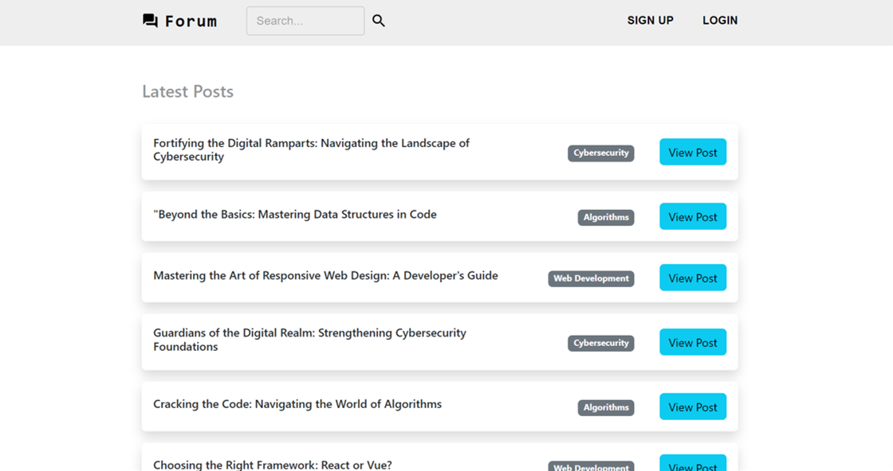

# Web Forum (by Tan Yi Xuan)
A responsive web app that allows users to discuss issues by creating threads and adding comments. <br />

**Link to project:** [https://mysite-zoa8.onrender.com](https://mysite-3k0r.onrender.com)



## Built With 💻
| **Front-end**  | **Back-end**     |
| ------------- | --------------  |
| - React       | - Ruby on Rails |
| - Typescript  | - PostgreSQL (Supabase)    |
| - Bootstrap   |                 |
| - Material UI |                 |
             

## Key Features ⭐
- Perform CRUD operations on forum threads & comments
- Search functionality to filter threads
- User authentication system using HTTP cookies and sessions

## Getting Started 🛠️
### Prerequisites
- Ruby 3.2.2
- Rails 7.1.2
- yarn

### Installation and Usage 
1. Clone this repository onto your local machine
2. Navigate to the directory containing your cloned project
3. Install the required dependencies by using: 
```bash
yarn install
bundle install
```
4. Initialise the database by using:
```bash
rails db:create
rails db:migrate
rails db:seed
```
5. Launch the app in development mode by using:
```bash
rails s
```
6. Open http://localhost:3000 to view the app in the browser
7. You should see a page like this:


## How it works 💡
**Backend**
- RESTful API was built using Ruby on Rails to handle CRUD operation on threads & comments through the Post and Comment controllers and models, which is integrated with a PostgreSQL database to store the data.

**Frontend**
- React frontend was integrated with backend through API calls using Fetch
- The index.tsx file served as an entry point to render all React components which were bundled by esbuild.
- App.tsx file was used to set up routing through the React router.
- Typescript was used to introduce static typing to catch type-related errors during development
- Styling was done using BootStrap CSS framework
- Navigation bar was built using Material UI library components

**Features**
- Only logged-in users can create, edit and delete posts & comments
- Non-logged-in users can only view the webpage
- Threads are tagged with a specific category and can be filtered through the search bar

**User Registration and Authentication**
- Registrations controller was added to create new user accounts through the User model, which encrypts passwords through the bcrypt gem
- Users can be registered and authenticated without passwords to facilitate ease of discussion
- Session store initializer was added to configure cookies
- CORS middleware was setup to handle external HTTP requests
- Sessions controller was added to create and destroy sessions, and to check whether a user is logged in
- When a user logins successfully, a HTTP cookie will be sent to the client and cached. This cookie will then be used for future backend API authentication and authorisation
- On the frontend, the root React component, App, contains a current_user state which stores user information and the user's logged in status. This state is updated using the handleLogin and handleLogout functions. The current_user state will be passed to child components to authorise actions such as creating, editing and deleting posts & comments 

**Deployment on Render**
- The web app was deployed on Render, which is a platform as a service (PaaS)

## User Manual 📖
**To view a post:**
- Scroll through the homepage and click “View Post” for the post you would like to view

**To filter posts:**
- Click the search field on the navigation bar
- Enter the category you would like to view
- Click the search icon / press enter

**To sign up for an account:**
- Click "Sign Up" on the navigation bar and you will be redirected to a sign up page
- Enter your username (mandatory) and password (optional)
- Click “Sign Up”
- If the username has already been selected by other users, registration will fail
- If the registration is successful, you will be redirected back to the homepage
- You can check your username by clicking on the profile icon at the top-right corner of the page

**To login to an existing account:**
- Click "Login" on the navigation bar and you will be redirected to a login page
- Enter your credentials and click “Login”
- If the login is successful, you will be redirected to the home page

**To log out:**
- Click the profile icon at the top-right corner of the page
- Click “Logout”

**To create a new post:**
- Ensure that you are logged into your account
- Click "New Post" on the navigation bar and you will be redirected to a form
- Fill in the form with the title, category and description of your post
- Click “Create”

**To create a new comment on a post:**
- Ensure that you are logged into your account
- Click the “Add Comment” button below the contents of the post
- Write your comment in the given text box
- Click “Comment”

**To edit/delete your post/comment:**
- Ensure that you are the author of the post/comment
- Click the “Edit” / “Delete” button
- Note: You will not be able to edit the title and category of the post
- Note: Deleting a post will delete all of its comments
